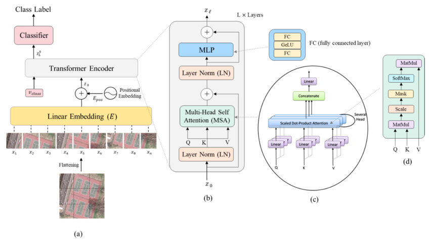

# VisionTransformer
Basic Vison Transformer implementation for MNIST classification. 
The goal was to get a good understanding of the transformer's working mechanism by coding.  
Used tools:
- PyTorch for training
- MLFlow for model tracking

### Model architecture:

<!-- ### Visualize the positional embeddings:
 -->
